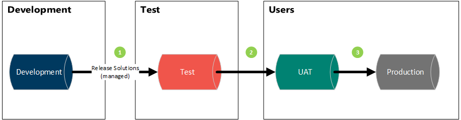
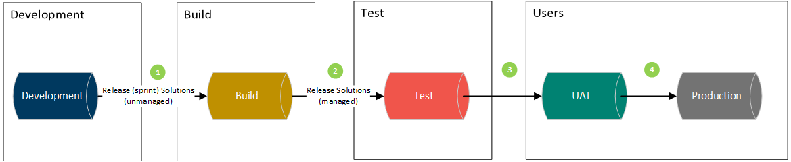

# Environment Strategy

This page applies to all Power Platform components that can be managed through solutions, including:

- Power Apps (Canvas Apps and Model Driven Apps)
- Power Pages
- Power Automate

An important assumption regarding the contents of this page is that during an implementation we deliver a customer specific solution instead of an App from the marketplace. This customer specific solution is often a solution that is built on top of the core solutions from Microsoft and third-party solutions.

This part highlights the standard scenarios for environments within the Power Platform, starting from a default scenario with additional options based on the type of implementation. Since most implementations differ in complexity, we must choose which environments to use at the start of an implementation. During the stages of a project, additional environments can be added when required.

Also refer to the Microsoft guidelines regarding environments: <https://docs.microsoft.com/en-us/power-platform/alm/environment-strategy-alm>.

## One Dynamics One Platform

Note that for every newly created UO environment an empty Power Platform Environment is created as well. Learn all about the One Dynamics One Platform practices via the link below.

- One Dynamics One Platform Practices

## Product specific environment strategies

Some products that are built on top of the Power Platform have additional environment strategies:

- Customer Insights - Data

## Default Environments for a Project

### Rule

Each implementation must have at least the following environments:

- **Development**: to configure the unmanaged customer specific solution
- **Acceptance**: to test the managed solution, the deployment, and the integrations with other applications
- **Production**: for production purposes

All environments must be configured according to the best practices defined on this page.

Additional environments can be included when required according to project requirements.

### Motivation

To develop and maintain an environment at least three environments are required. An additional testing environment can be used to test a deployment without conflicting with ongoing acceptance tests.

## Environment Scenarios

The classic overview of environments consists of a Development, Test, UAT and Live environment.

**Figure 1. Classic environment strategy**

When working with Azure DevOps build pipeline and the solution split based on components, the following environments are necessary. Please refer to the Power Platform - Deployments for further information regarding automated deployments.

**Figure 2. Environment strategy**

The image provided illustrates an environment configuration where the Reference Data resides in a separate environment, and the deployments are carried out using Azure DevOps build pipelines.

**Figure 3. Environment strategy with Azure DevOps Pipelines**

Visio file: Build CICD for Microsoft Power Platform Architecture

## Azure DevOps Pipeline Flow

- **Continuous Integration Pipeline**: triggers on code commits for C#, TypeScript and JavaScript. Check for more details: CI Pipeline.
- **Customizations Extract Pipeline**: retrieve the customizations made in a development environment, extract the solution, and commit the components to source control. Obtain the most recent version of the compiled code, and register and import the code and customizations into the build environment. Check for more details: Build-Update.
- **Build Pipeline**: exports your solutions and reference data and commits them into source control. Check for more details: Export.
- **Release Pipeline**: deploys the release package created in the build pipeline to Test, UAT and Production, and any other environments you may have. Check for more details: Deploy.

## Description of Each Environment

> **Note**
> All environments are sandboxes, except for the Live environment(s).

| Environment | Goal | User |
|---|---|---|
| Development | To support the development of new features or to resolve bugs. The environment will be used as a single development environment. When multiple streams are needed, see the Multi-Instance-Development guideline. | Development team |
| Development Release | Optional environment. To support the development to resolve bugs for stabilizing the release, so that development environment can be used for the next release. | Development team |
| Build | To support the automated deployment strategy regarding solutions. A build environment is needed. This build environment compiles all the components to deployable solutions. This environment can also be used for maintaining master or reference data that is needed in all other environments.  **Note:** deleting components from Dev to Build is not supported at this moment and should be done manually. An automatic version is in the making. | Deployment Administrator |
| Reference Data | Optional environment; this can also be done in the Build environment. This environment can be used for maintaining master or reference data that is needed in all other environments. | Deployment Administrator |
| Test | To test if a release was successful and to test the features within the application. Also used for configuration of data integrations. | Development team / Test team |
| UAT | To test and accept the features within the application by end users. This environment contains all integrations in a similar way as the production environment. | Test team / End users |
| Live / Production | Production instance. | End users |

## Additional Environments

In some situations, additional environments are required. This chapter outlines these scenarios.

To simplify the scenarios, the Build environment is not mentioned here. When working with a Build environment, this environment must be placed between the Development and Test environment.

## Maintenance / Wave Updates

When there is an active project and maintenance on the production environment is required, it might occur that hotfixes, wave updates or third-party solutions must be released to the production environment before new project deliverables are released to production. To achieve this, the following additional environments are required:

- Development for hotfix
- UAT for hotfix

From the Development (Hotfix) environment managed solutions can be released. These solutions must be removed after a new update is installed from the Development (Primary) environment, if the changes are included in the regular solution as well.

The Development (Hotfix) environment is copied from the Development (Primary) or the Build environment. The Test (Hotfix) and UAT (Hotfix) are both copies of UAT (Release). After applying changes to the Development (Hotfix) environment, these changes should also be imported in the Development (Primary) environment.

Be careful when applying changes in Development (Hotfix), as technical implications cannot be undone after a release to the production environment. Some changes, for example creating business rules or registering/deregistering plugins, create GUIDs which you cannot see but which have consequences during import. These GUIDs should always be equal on all environments. That is why changes on Development (Hotfix) should be imported to Development (Primary).

### Tips

Please check the requirements regarding creating a copy from production when production specific data is needed for test requirements.

When a DevOps process is applied properly, a situation with a maintenance environment should not be required, since the release cycle would be fast enough to apply bug fixes in time.

## Release

When Dynamics 365 is in production and development is still ongoing, a stable code freeze "release" environment can be required to perform small updates or fix bugs after user acceptance testing. This release environment will act in a similar way to the development environment.

The initialization of the Development (Release) is by creating a copy of Development (Primary). Test (Release) is initiated by a copy of UAT (Release).

The development team can continue working on new features through the Development (Primary) and Test (Primary) environments. While a stable version is tested by the key users on the UAT (Release). When minor fixes need to be done on the release, these changes are applied on the Development (Release) environment and tested on the Test (Release) environment before being rolled out to UAT (Release). When the changes are approved, the changes are imported in Development (Primary) to make sure they are not lost during a next release.

### Warning

Any bugfix must be applied to the primary development by unmanaged solutions. This is done in order to prevent loss of GUIDs and IDs that Dynamics 365 uses for field identification and other customizations and to make sure future deployments to production are possible.

## Training

When end user trainings are performed, training data is often required. This training data might affect ongoing acceptance tests and therefore an additional environment could be required.

This training environment should be updated in the same way the UAT environment is updated and it is advisable to load this environment with dummy data. This environment is used by trainers and end users.

### Warning

Only apply release solutions that are thoroughly tested to maintain continuity of the training environment.

## Complex Data Migration

When a complex data migration is applicable for an implementation, an extra environment is usually needed to develop and test the data migration. This is to ensure that data migration does not affect ongoing development or testing.

In the early stage, this environment is used by the development team. When data migration is ready to be tested, the test team can access this environment to test the data migration.

It is advisable to regularly update the Test (Migration) environment with new customizations, in the same cadence as the Test (Primary) environment, to make sure all fields, business rules and changes are reflected during the development and testing of the data migration.

## Different Features

When a business process, with a specific feature turned on or off, or a specific feature that may not go live needs to be tested, an extra Test environment is usually created to support this process. An acceptance environment should not be used for this purpose, since the acceptance environment must reflect the next release to the live environment and therefore has specific features disabled or enabled based on that environment.

### Tips

For a more complex scenario with continuous development and release functionality, see [Release](#release).

## Multiple Live Environments

When the decision is made that multiple live environments are required, there should also be an acceptance environment reflecting that extra live environment.

These environments are used by key users and/or end users.

## Multi-stream Development

When a lot of features are developed for a customer and these functionalities can be divided in multiple core streams, with minimal overlap in entities, multi-stream development is a good way to develop new features. To be successful with multi-stream development, some prerequisites must be met:

- Deployment of solutions must be automated.
- Everyone configuring the system must be aware of Power Platform solution layering, deployment and dependency concepts.
- Changes on the Build environment must be made with care.
- The customer must accept that from a technical point of view, all features go live at the same time.

To achieve multi-stream development, two or more development environments must be set up. On these environments, single stream functionality is developed. When the development is done, the solutions are exported to Build as managed solutions. On cross-stream development, there is the possibility to develop cross-stream functionality, for example form modifications on Account, Contact, User, and so on.

After the changes are done on the Build environment, the cross-stream solutions can be exported and imported in Test with the managed stream solutions.

## Multi Country Setup

### Rule

When a customer has multiple countries using Dynamics 365, the default is to use one organization. However, if this is not feasible due to legal requirements, separate acceptance and production instances must be used.

If separate instances are used, they must be identical solution-wise to each other.

If the customer has special requirements and some countries need their own changes on the customer base, a complex deployment scenario is started. Please contact one of the document creators for more information on how to implement this.

### Motivation

When applying customer relationship management within your corporate organization you might service customers over multiple countries. To achieve a 360-customer view, one system is preferred. However, customers must always comply with local legislation, for example regarding data that must stay within a country, resulting in separate instances.

To facilitate deployments, instances must be identical in terms of solution.

### Example

An organization has three countries, which for legal reasons must be split. This results in the following environments:

- Development, for the kernel
- Test, for the kernel
- 3 country-specific Acceptance environments
- 3 country-specific Live environments
