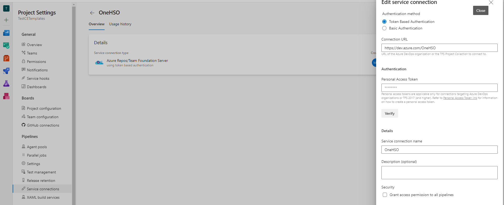
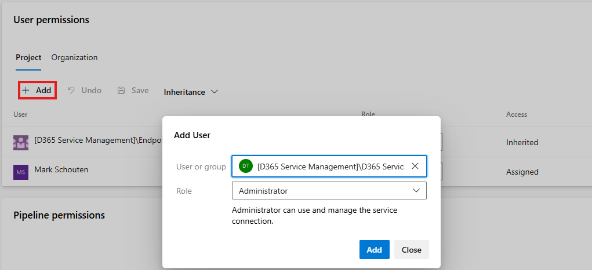
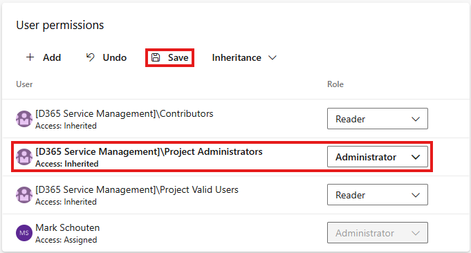

# Setup V1 Templates

You first need to get the extension shared with your DevOps organization. In order to do that, you need to fill in this form. This form contains different questions where the answer is used to adapt your implementation. Many, if not all, questions should already be covered by the solution blueprint in the discovery phase.

After filling in the form, contact Martijn Vermaat or Erik Pellegrom to get it shared with your organization. After that is done, a project collection administrator can install the extension on your DevOps organization.

## Setup Repositories

Create a git repository for your project and copy the contents of the template repository into it.

If you have a build environment, create a second git repository called 'SprintSolutions'. Leave it empty. Make sure the default branch is named 'main'.

## Setup Service Connection

You will need to setup a PAT on the OneHSO page with the following permissions:

- Code - Read

After that, you create a service connection to OneHSO in your DevOps organization. Make sure to name it 'OneHSO'. Make sure everyone knows about this, as these PATs expire. They will always expire at the wrong time (like right before a production deployment), so make sure everyone knows how to refresh them.

### Grant Administrator permissions to other team members

Administrator permissions are needed to update the PAT for the service connection.

When creating a service connection, only the creator is automatically granted Administrator permissions. You can grant Administrator permissions to other users by adding a team or individual users.

## Grant Build Service Access to repositories

This is a very important step, as without these permissions, the commit steps of the pipelines will fail. Due to the nature of Git, this won't show up as an error in the execution of a pipeline.

1. Go to Project Settings → Repositories → Your Repository → Security.
2. Grant build service 'Contribute' and 'Bypass policies when pushing' permissions.
3. Repeat the same for the 'SprintSolutions' repository if you have a Build environment.

## Environments

Create environments for every CE environment you have. The required environments can be distilled from the solution blueprint and/or form. Your TA on the project should be able to provide this information. The most likely environments are described below. A description of the different environments can be found here.

### Grant Administrator permissions to other team members

Administrator permissions are needed to grant access for pipelines and change approvals.

When creating an environment, only the creator is automatically granted Administrator permissions. You can grant Administrator permissions to other users by changing the role for the Project Administrators or by adding permissions for a custom team or user.

### Minimal setup

These environments you will always have:

- Dataverse_Development
- Dataverse_Test
- Dataverse_Production

### Acceptance environment

Almost certainly you will also have an acceptance environment. Check the form and verify the reasoning with the TA if there is no acceptance environment required.

- Dataverse_Acceptance

### Build Environment

In case of a platform project, this is mandatory. In non-platform projects with biz apps (sales/project operations/field service/etc), it's the default. If there is no build environment for this kind of implementation, verify the reasoning in the form or with the TA. For maker scenarios, the build environment is not used by default.

- Dataverse_Build

### Hotfix environments

In most cases you want to be able to perform hotfixes on the production environment while developing this release. If this is not included, verify with the TA on why not.

You need to have at least either a test or acceptance environment (both are fine too) next to the hotfix development environment.

- Dataverse_HotfixDevelopment
- Dataverse_HotfixTest
- Dataverse_HotfixAcceptance

### Additional environments

Verify with the TA which additional environments are needed. This can be any kind of environment. Below are a couple of examples:

- Dataverse_Training
- Dataverse_Migration

### Setting up approvals on the environments

For each of the environments, you should add approvers. The approvers should be determined based on project requirements. Below is an example:

1. Create two teams: "Deployment Approvers - HSO" & "Deployment Approvers - {customername}".
2. Set the HSO team as approver for each environment.
3. Add the customer approver team to Acceptance & Production as second approver.
4. Add approvers to each team. Add enough so at least 1 person is available. Project Admins can always approve if needed, even if they aren't in the team. Only use that in exceptional situations.

## Variable Groups

### Versioning

If you are not using a build environment, you don't need to add the 'SprintNr' and 'ReleaseName' variables.

| Variable | DataType | Description/Value | Example |
|---|---|---|---|
| Major | Integer | Major version of your solution (x.0.0.0) | 1 |
| Minor | Integer | Minor version of your solution (0.x.0.0) | 0 |
| SprintNr | String | For downloading your sprint solution: CESolutionSprint | 6 |
| ReleaseName | String | For downloading fix solutions: {ReleaseName}FixesV01 | MyRelease |

### Dataverse_Global

| Variable | DataType | Description/Value | Example |
|---|---|---|---|
| ClientId | String | Client ID of the app registration used for deployments | 55f2e097-4753-4a90-a66f-592e349c76f5 |
| ClientSecret | String (Secret) | Client Secret of the app registration used for deployments | efVi6.ybt21_Fe_O-AxE-Z4JV6by60-t3u |
| Username | String | Username of an interactive user that is admin. Only required if you have automated UI tests. | serviceaccount@customer.com |
| Password | String (Secret) | Password of an interactive user that is admin. Only required if you have automated UI tests. | SomeStrongP@ssword! |
| PowerAutomateOwner | String | Username of the user that owns the connections for Power Automates | serviceaccount@customer.com |
| CIBuildDefinition | Integer | Build Definition ID of the CI pipeline. Can be found in the URL of your build pipeline. Fill this in after creating the CI pipeline. | 1 |
| CommitUsername | String | User name (display name) of the user that must be displayed when committing to a repository using pipelines. | Pipeline Automated Commit |
| CommitEmail | String | Email address of the user that must be displayed when committing to a repository using pipelines. | serviceaccount@customer.com |
| TenantId | Guid | ID of the tenant where the Power Platform environments are. You can find this in the Azure portal on any account that has an account on the tenant (can be a guest account). | B9A57A3D-3055-47F0-A030-472E6096E2A8 |

### Dataverse_xxxx

For each environment you have setup, you need to create a variable group like below.

| Variable | DataType | Description/Value | Example |
|---|---|---|---|
| Url | String | URL to the DEV Dataverse environment | https://myorg-dev.crm4.dynamics.com |

## Pipelines

You will need to create several pipelines. Almost every pipeline has some optional variables you may need to set for your project. See the notes within the pipeline yaml file for additional guidance.

### CI Pipeline

This pipeline will compile your code on commit and run unit tests. Use the path below as the YAML file. After creating this pipeline, you need to add the definition ID to the 'Dataverse_Global' variable group. A detailed explanation of the pipeline and all its variables can be found here.

Path: `build\pipelines\CI.yml`

### Generate Early Bound

This pipeline is to generate early bound classes for your solution. This must be done if the Plug-in or TypeScript template is implemented, else this pipeline can be ignored. A detailed explanation of the pipeline and all its variables can be found here.

Path: `build\pipelines\Generate-Early-Bound.yml`

### Build-Update

This pipeline is for moving your sprint solutions from Development to Build. You can skip this pipeline if you don't use a build environment. A detailed explanation of the pipeline and all its variables can be found here.

Path: `build\pipelines\Build-Update.yml`

### Export

This pipeline is to export your solutions & reference data and check them into source control. This pipeline must always be setup. A detailed explanation of the pipeline and all its variables can be found here.

Path: `build\pipelines\Export.yml`

### Deploy

This pipeline is for deploying your solutions to all managed environments. You modify the templates depending on the environments. This pipeline must always be setup. A detailed explanation of the pipeline and all its variables can be found here.

Path: `build\pipelines\Deploy.yml`

### Copy

This pipeline is for automating copying/restoring environments. When you perform a copy or restore you always have a bunch of manual steps you need to do after the copy. This is an optional step if you expect to do many copies. A detailed explanation of the pipeline and all its variables can be found here.

### Reference Data

This pipeline is for deploying reference data only. This is useful when you want to push a change to the reference data to production without pushing a new version of the solutions. Also, if you have a build environment, you need this pipeline to push the reference data from Build to Development. This is a recommended pipeline for all implementations and a mandatory one if you have a build environment. A detailed explanation of the pipeline and all its variables can be found here.

### Activate HSO Innovation licenses

This pipeline is only useful if your project uses one or more HSO Innovation modules. If you do, then setup this pipeline. If you don't, then skip this.

## Power Pages

If your project includes Power Pages, please also perform these setup steps.
