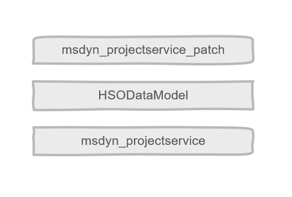
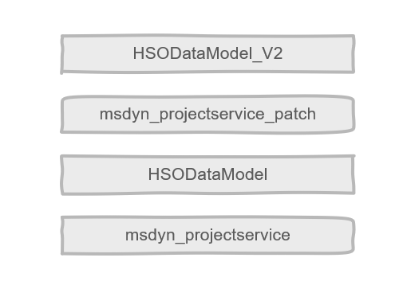
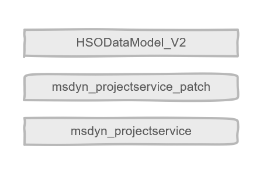
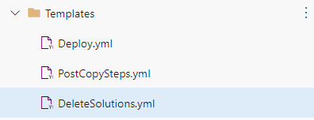

# Solution Postfixing

Sometimes we run into problems regarding solution layering. Microsoft sometimes installs new solutions in their updates. These solutions will be put on top of our managed solutions and thus cause our changes to be overwritten. Solution postfixing solves this problem in a very generic and simple way.

Let's start with the example below. We have a solution that was installed on top of Project Service. Microsoft installed a new solution and overwrote our changes.



There are different ways to fix this problem, however these fixes tend to be tedious, complex or run into problems some way. The most common one is removing the component from the solution, deploying, re-adding the component and finally deploying again.

This is the fix most of the time advised by Microsoft, but this can cause troubles in some situations and is therefore not a generic solution. This will work unless the component has dependent components (if it has, you can't remove it) or if it's a column (if you remove it, you lose the data). Next to that, it makes the deployment process a little more complicated as you want to perform this action at a different time on each environment, and between these times you need fixes. Because of this, we don't recommend this approach.

In the pipeline templates we have added an option to supply a postfix to your solutions. This will basically change the unique name of the solution. In our example the postfix will be '_V2'. We will now deploy the solution to the target environment and then it will look like the image below.



As the solution has a different unique name, this will cause a new solution layer which will end up on top. The next step is to delete the old solution and then it will look like below.



So this basically works for everything. The added advantage is that you will fix all solution layers at the same time, even the ones you don't know which were overwritten.

## How to implement this in your pipelines

First you need to update the Export pipeline. [The template has a postfix parameter you can supply](https://dev.azure.com/OneHSO/HSO%20Best%20Practices/_git/PP-099-PipelineTemplates?path=/ManagedExport/Main-Solutions.yml&version=GBreleases/v1&line=22&lineEnd=24&lineStartColumn=1&lineEndColumn=14&lineStyle=plain&_a=contents). Doing that will give a postfix to all solutions.

```yaml
  - template: 'ManagedExport/Main-Solutions.yml@templates'
    parameters:
      connectionString: '$(ConnectionString)'
      postfix: '$(Major)'
```

In this example the existing variable $(Major) is used. This is the major version of your solution. You can use any variable/value you want, but this is a good one to use. Whenever you increment the major version of the solution, it will get a new postfix.

Now that's done, you need to run the pipeline and all solutions will have the postfix also applied in version control. The deployment pipeline automatically detects this as the postfix is also written to version control. If you would run the deployment pipeline now, it will already import the postfixed solutions.

The only thing missing now is the deletion of the current solutions. To do that, start by creating a new template yaml file named 'DeleteSolutions.yml' in the templates folder (or open the one if you already have one).



Add the following code to the template:

```yaml
parameters:
  connectionString: ''
  solutionsToRemove: []

steps:
- ${{ each solution in parameters.solutionsToRemove }}:
  - task: HSONNCheckRunningSolutionImports@4
    displayName: 'Check for running solution Imports'
    inputs:
      connectionString: '${{ parameters.connectionString }}'
      excludedPublisher: '${{ solution.previousPublisher }}'
  
  - task: HSONNRemoveSolution@4
    displayName: 'Removing Solution: ${{ solution.name }}'
    inputs:
      solutionName: '${{ solution.name }}'
      connectionString: '${{ parameters.connectionString }}'
      timeoutInSeconds: '${{ solution.timeout }}'
```

Now open the [deploy.yml template](https://dev.azure.com/OneHSO/HSO%20Best%20Practices/_git/PP-099-PipelineTemplates?path=%2Fbuild%2FPipelines%2FTemplates%2FDeploy.yml&version=GBexamples%2Fv1&_a=contents) file that's located in the same folder as the 'DeleteSolutions.yml' file you just created. Here you need to add a parameter for the extra DeleteSolution steps:

```yaml
deleteSolutionSteps:
- template: 'DeleteSolutions.yml'
  parameters:
    connectionString: '$(ConnectionString)'
    solutionsToRemove:
    - name: 'HSOPowerPlatform_V1'
      timeout: 3600
      previousPublisher: 'hso'
    - name: 'HSOAppsandClientExtensions_V1'
      timeout: 3600
      previousPublisher: 'hso'
    - name: 'HSODashboardsandReports_V1'
      timeout: 3600
      previousPublisher: 'hso'
    - name: 'HSOProcesses_V1'
      timeout: 3600
      previousPublisher: 'hso'
    - name: 'HSODataModel_V1'
      timeout: 14400
      previousPublisher: 'hso'
    - name: 'HSOUserInterfaceComponents_V1'
      timeout: 3600
      previousPublisher: 'hso'
    - name: 'HSOWebresources_V1'
      timeout: 3600
      previousPublisher: 'hso'
```

You need to change the solution names to the solutions you are using and need to delete (so the previous solution names). Also change the publisher if you use a different one.
