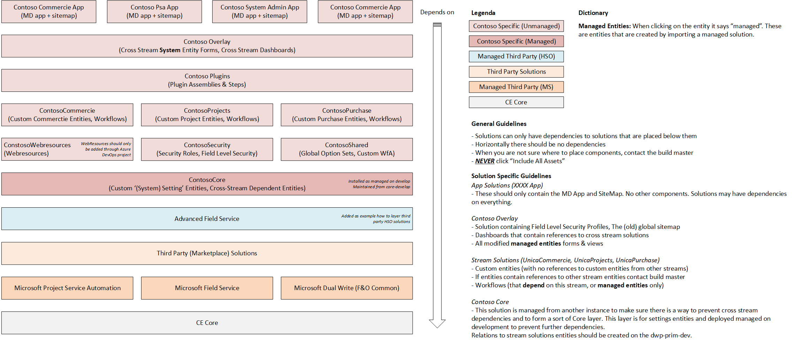
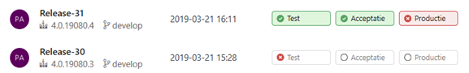
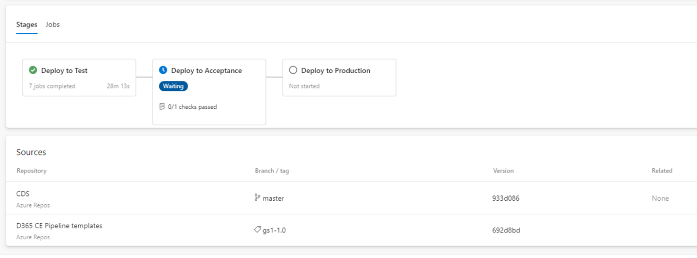

# Solution Strategy

## Creating a solution

### Rule

A customer prefix should be used when the IP of the product belongs to the customer (ask your project manager if you are not sure).

When creating a solution, and the IP belongs to HSO, we must use HSO CRM Solutions as publisher, technical name `hsocrmsolutions` and prefix `hso_`.

When creating a customer specific solution, it should have the name of the customer as DisplayName.

### Motivation

When the customer owns the IP of the custom configuration that HSO executes, a customer prefix and publisher should be used. In this case the customer is responsible and therefore we can use the customer prefix. When the IP belongs to HSO, HSO is responsible for the configuration of the solution and therefore this is the correct publisher.

If you don't know which prefix to choose, ask the Technical Solution Architect. This is something you don't change without a massive impact.

## Only one custom Power Platform publisher should be used

### Rule

When creating one or multiple solutions for a customer, only one custom publisher should be used to release software to other environments.

### Motivation

The publisher of a solution where a component is created is considered the owner of that component. The owner of a component controls what changes other publishers of solutions including that component are allowed to make or restricted from making. It is possible to move the ownership of a component from one solution to another within the same publisher, but not across publishers. Once you introduce a publisher for a component in a managed solution, you can't change the publisher for the component. Because of this, it's best to define a single publisher so you can change the layering model across solutions later.

This is something you don't change without a massive impact.

*Source: docs.microsoft.com*

## Solution components

### Rule

A solution must only contain components that are changed. Never let the system add related components.

### Motivation

Only including changed components prevents conflicts during deployment and with updates from Microsoft or other third parties. Also, a smaller solution will speed up the import into the destination environment.

## Solution checker

### Rule

A solution must be checked with the solution checker before it is deployed to another environment. Any issue resulting from this check must be resolved (or explicitly modified).

### Motivation

The solution checker confirms to what extent the solution complies with Microsoft's standards, which is required for a stable and supported solution. For more information regarding this solution: https://docs.microsoft.com/en-us/powerapps/maker/common-data-service/use-powerapps-checker

### Example

The solution can be checked from the Power Apps admin center. Checking the solution can take a few minutes. Once the check has completed, the results can be viewed in the browser or downloaded as an Excel file.

## Power Platform components in a separate solution

### Rule

Always place all Power Platform components that use connection references in a separate solution and have no other solutions dependent on it.

### Motivation

During environment copies, the connection ID within the connection references remains intact. This means that after a copy, the connection references refer to a connection that doesn't exist.

If you have a Power Automate flow with 2 connection references and you update the first connection reference with the new correct connection, then Dynamics will try to update the flow itself and that will fail as the other connection reference refers to a different connection. This basically means you are in a deadlock and can't fix any of the connection references. To resolve this, you need to uninstall the solution and then reinstall it, and by having them in a separate solution with no dependencies to it, this becomes possible.

## Solution structure

### Rule

The solutions in the development environment must be split either based on functionality or based on technical components. When no specific core functionality can be defined, and only minimal customizations are required, then one main solution is sufficient.

The separation of components should always follow the Microsoft guidelines. Microsoft recommends avoiding creation of multiple solutions when there are dependencies between the solutions.

Splitting on functionality vs technical components should be decided by the Technical Lead and/or the Technical Solution Architect on the project.

### Motivation

When everything is added to a single solution, the solution import might take a long time.

When using separation based on functionality, it's often easier to see what components are impacted by a change of a field, since this field is included in the solution where it has impact. Via "view solution dependencies", the impact can be determined and it is visible in which solution the components are included.

When splitting based on technical components, this is done to make sure the deployment time is decreased.

To see how solutions and customizations behave, visit: Solution layers - Power Apps

### When to use what?

When only minimal customizations are required (10 custom tables, 5 Power Automate flows, 10 plugins), two solutions (Power Platform components in 1 and the rest in the other) is sufficient. When more customizations are required, it should be split up either based on functionality or on components. The latter can be done automatically but can still lead to large solutions and long deployment times for enterprise customers. The first option is more manual work to set up and requires trained Power Platform consultants.

### Example: Splitting solutions based on functionality

When splitting solutions based on functionality, the following guidelines should be followed:

- Make sure there is a clear solution structure and responsibility per solution (see image below).
- Make sure the whole team knows, or asks, where components should be added when new fields or dependencies are introduced.

The following solutions are often needed (please note that for multi-stream development this model is different). Please keep the naming convention as described in "Creating a solution".

| Name | Description |
|---|---|
| HSO - Base | For base components: Custom Controls; shared (settings/option set) entities; shared webresources. Try to keep this solution to a minimum, to keep deployment quick. There should be no dependencies in this solution. This solution must be deployed first. |
| HSO - Feature X | For all components featuring functionality X. This includes: entities, forms, charts, dashboards; plugins; workflows; dashboards and views based on entities only included in this solution; app (if standalone for this functionality); etc. This solution should only have dependencies on: HSO Base; HSO Security. Otherwise deployment of clean environments becomes impossible. Dependencies must be managed carefully. |
| HSO - Reports | Reports |
| HSO - Apps and Client Extensions | Shared Apps and Client Extensions (Sitemap) |
| HSO - Security | Security roles (and profiles) |

#### Security Roles

During deployments, the security roles solution must be imported twice due to possible dependencies (at the start, to resolve dependencies on roles used by forms, and at the end, to make sure security settings for newly introduced entities are applied).

#### Field Level Security

It is useful to create a solution for Field Level Security profiles if they are applicable to the project. The Field Level Security profile needs to exist before the fields (that use Field Level Security) can be imported.

### Example: Splitting solutions based on components

Splitting solutions based on components can be done by using the HSO Azure DevOps build and release tasks. These steps help to split up components and automatically create the necessary solutions. Please refer to Set-Up Deployment with Azure DevOps to set up automated deployment.

The following solutions are given as a guideline.

| Name | Display Name | Description | Reason |
|---|---|---|---|
| HSOCustomConnectors | HSO - Custom Connectors | Custom Connectors | Custom Connectors must be in a separate solution, because they need to be present when you import a cloud flow. |
| HSOEndpoints | HSO - Endpoints | Service Endpoints | Service Endpoints must be in a separate solution, because during import the endpoint URL will be reset to the value from DEV/BLD. By putting the endpoints in a separate solution, the solution will not be imported and the URL will not be overwritten when nothing has changed. |
| HSO | HSO - Main Solution | Main solution containing most components | By using a single main solution for most of the components, single step upgrade can be used during solution import. |

Based on the customer case, other (third party) solutions are involved, and the solutions might be split based on other criteria. It is good to create a solution overview per customer to show everyone how the solutions are layered and where they should develop which components.

The original file can be found here: Components Based Structure (you can use this Visio file to make a schema specific for your customer)

## Deploying a main solution to test and production

### Rule

When deploying a solution, it should be deployed through Azure DevOps using automated deployment.

When deploying a solution from a development environment, it must first be deployed to Test (if applicable), then to Acceptance and then to Live.

Please refer to: Deployments on how to set up Automated Deployment.

Please refer to: Environment Strategy on how to set up environments.

### Motivation

Automating the deployment of the main solutions simplifies the process and makes sure the solutions are always deployed in the same order.

The deployment order is important, since customizations are handled in installation order.

See: https://docs.microsoft.com/en-us/powerapps/maker/data-platform/solution-layers#view-the-solution-layers-for-a-component

### Example

## Deploying as managed solution

### Rule

A solution must be deployed as a managed solution to the test, acceptance or live environment.

### Motivation

Managed solutions are meant for distribution to other environments. Unmanaged solutions will lead to conflicts and unpredictable behavior of the other environments. In addition, only managed solutions can be used for automated deployment (for more information regarding solutions: https://docs.microsoft.com/en-us/dynamics365/customerengagement/on-premises/customize/solutions-overview#managed-and-unmanaged-solutions).

## Deploying as a service user

### Rule

A solution must be deployed through Azure DevOps with an application user and not a personal user account.

### Motivation

Processes should be owned by a service user and the user deploying the solution is also the user owning the processes in the target environment. It's also more secure as these users are non-interactive, and thus improve security as you can't manually log in and perform actions with them. Next to that, they have way higher API limits compared to regular users.

## Deploying a patch

### Rule

When you need to deploy a patch for a specific component, it may be created as a separate solution in the development environment and deployed manually as a managed solution. This solution must be removed after the next successful deployment of a regular solution that also contains all changed components in the separate solution in all environments.

The patch feature by Microsoft should not be used.

### Motivation

A separate patch solution can contain one or more components such as form(s), workflow(s) or business rule(s), and therefore be easily deployed and tested. When deploying this as a managed component, it does not conflict with the current solution and potential next release, and can be removed afterwards.

Using the patch features from Microsoft is not recommended, since this would prevent customizing the main solution in the development environment (https://docs.microsoft.com/en-us/power-platform/alm/update-solutions-alm#create-solution-patches).
