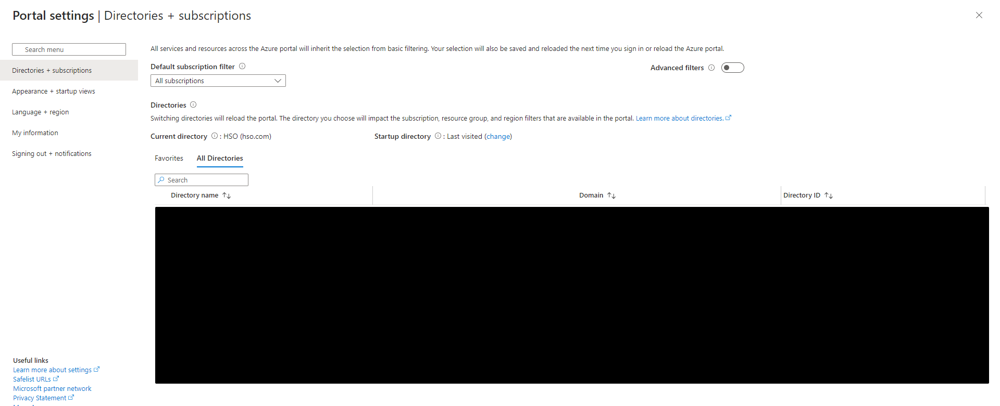

# Upgrade Instructions

A whole bunch of custom functions in our pipelines are already available in the PAC CLI. Over time, tasks will be changed where possible to use PAC CLI. Unfortunately, Microsoft uses a different authentication method for PAC CLI which requires the Tenant ID.

You can retrieve the Tenant ID by connecting to Dataverse, however as this is a static value it's recommended to set this in Azure DevOps as a variable. For backwards compatibility, the tooling will get the ID from Dataverse and throw a warning when your implementation doesn't supply it.

## Where to find the Tenant ID

This is a static value that you can find in the [Azure portal](https://portal.azure.com/#settings/directory). This page shows all tenants the account has access to, both your own tenant and all tenants you have a guest account in. This means you can either log in with an account of the customer's tenant or use your HSO account if you have a guest account there. You then get the 'Directory ID' from the table.

## Where to put the Tenant ID

You put it in the variable group ['Dataverse_Global'](https://docs.hso.com/PowerPlatform/Governance/ApplicationLifecycle/HSOExtension/Templates/v1/#Dataverse_Global).

## What to update in the pipeline yaml files

You need to add the tenantID parameter to the following areas:

- [Build-Update Export](https://dev.azure.com/OneHSO/HSO%20Best%20Practices/_git/PP-099-PipelineTemplates?path=/build/Pipelines/Build-Update.yml&version=GBexamples/v1&line=50&lineEnd=51&lineStartColumn=1&lineEndColumn=1&lineStyle=plain&_a=contents)
- [Build-Update Import](https://dev.azure.com/OneHSO/HSO%20Best%20Practices/_git/PP-099-PipelineTemplates?path=/build/Pipelines/Build-Update.yml&version=GBexamples/v1&line=72&lineEnd=73&lineStartColumn=1&lineEndColumn=1&lineStyle=plain&_a=contents)
